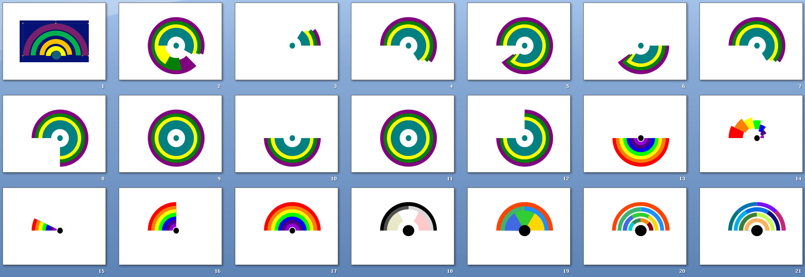

# PPT VBA Lint
Set of scripts and utilities to ensure consistent look and feel of PPT presentations and higlight any issues. Other utilities and tools.

### vba-lint
This VBA script audits PowerPoint slides by checking that each shape’s fill colours, line colours, and text fonts comply with approved values defined in an external configuration file (config.ini). 

### add-palette-to-master-slide
Creates a small pallette in the bottom right corner of your master slide. Just hide it in master slide when you're done. 
(Doesn't yet work with config.ini)

###
drawio-to-powerpoint
Takes native drawio XML and converts it to native PowerPoint drawing. Approximate. Colour conversion to your standard palette.
(Doesn't yet work with config.ini)

### export-slide-region
Take a small portion of a slide and export it as image. Useful when you're building minified naviation, for example.

### ranbow-diagram
Creates a rainbow diagram. Set segment sizes and colours in the code.

Picture below shows the evolution using AI to generate the code behind the graphic. First image is sample input we had, then various attempts witht he o1 model never getting the offsets right (PowerPoint is to blame). Then the 0o3-high model took over. I mentioned "rainbow" and it's done that immediately. Eventually it got coaxed into the right output. What's interesting is that in solving the issue it eventually dropped the circle arc shape, or at least in the fashion it would be used by humans (it's done overlapping construction).

