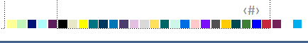
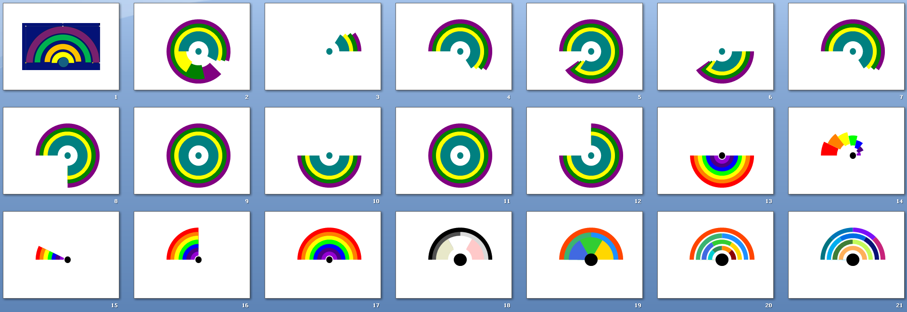

# PPT VBA Lint
Set of scripts for PowerPoint 

### vba-lint
Audits slides against your defined corporate Colour Scheme (in config.ini) and Font Scheme.
Checks each shape’s fill colours, line colours, and text fonts. 

### add-palette-to-master-slide
Creates a small pallette in the bottom right corner of your master slide. 
Just hide it in master slide when you're done. 

### drawio-to-powerpoint
Takes native drawio XML and converts it to native PowerPoint drawing. Approximate. Colour conversion to your standard palette.
- Allows for layer exclusion by name.
- Allows for specified layers to be moved to back. 

### export-slide-region
Take a small portion of a slide and export it as image. Useful when you're building minified naviation, for example.

### rainbow-diagram
Creates a rainbow diagram. Set segment sizes and colours in the code.

Picture below shows the evolution using AI to generate the code behind the graphic. First image is sample input we had, then various attempts witht he o1 model never getting the offsets right (PowerPoint is to blame). Then the 0o3-high model took over. I mentioned "rainbow" and it's done that immediately. Eventually it got coaxed into the right output. What's interesting is that in solving the issue it eventually dropped the circle arc shape, or at least in the fashion it would be used by humans (it's done overlapping construction).

